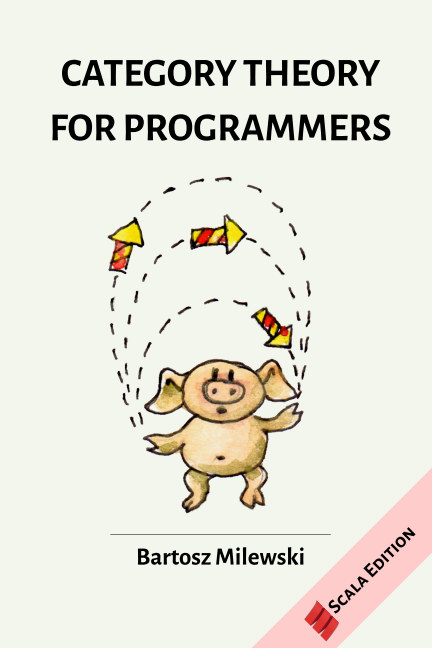

### Problem sets of the book 'Category Theory for Programmers' by Bartosz Milewksi

Most of the problem sets are (so far) solved in Python.
For the problems/examples in Scala, a Jupyter Scala kernel needs to be installed on your system. I'm currently using the [Almond](https://almond.sh/docs/quick-start-install) kernel (Scala v. 2.13.1, Almond v. 0.9.1).

  

